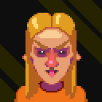
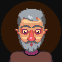

# Characters

## **Content:**
- [Main characters](#main-characters)
- [Enemies](#enemies)
- [Non-playable characters](#non-playable-characters)

# Main characters

| | Name | Description | Characteristics | Misc. info | 
|-|------|-------------|-----------------|------------|
|| James Testolini| Describe the character. It is a playable character or NPC. How does this character fit into the story, etc.|Describe the character’s abilities, personality and so forth.|Present any other notes about the character.|

# Enemies

| | Name | Description | Characteristics | Misc. info | 
|-|------|-------------|-----------------|------------|
|| Bernie Evil| Describe the character. It is a playable character or NPC. How does this character fit into the story, etc.|Describe the character’s abilities, personality and so forth.|Present any other notes about the character.|

# Non-playable characters

| | Name | Description | Characteristics | Misc. info | 
|-|------|-------------|-----------------|------------|
|| Roy Brewer | Describe the character. It is a playable character or NPC. How does this character fit into the story, etc.|Describe the character’s abilities, personality and so forth.|Present any other notes about the character.|
|| Karen Shoutalot| Describe the character. It is a playable character or NPC. How does this character fit into the story, etc.|Describe the character’s abilities, personality and so forth.|Present any other notes about the character.|